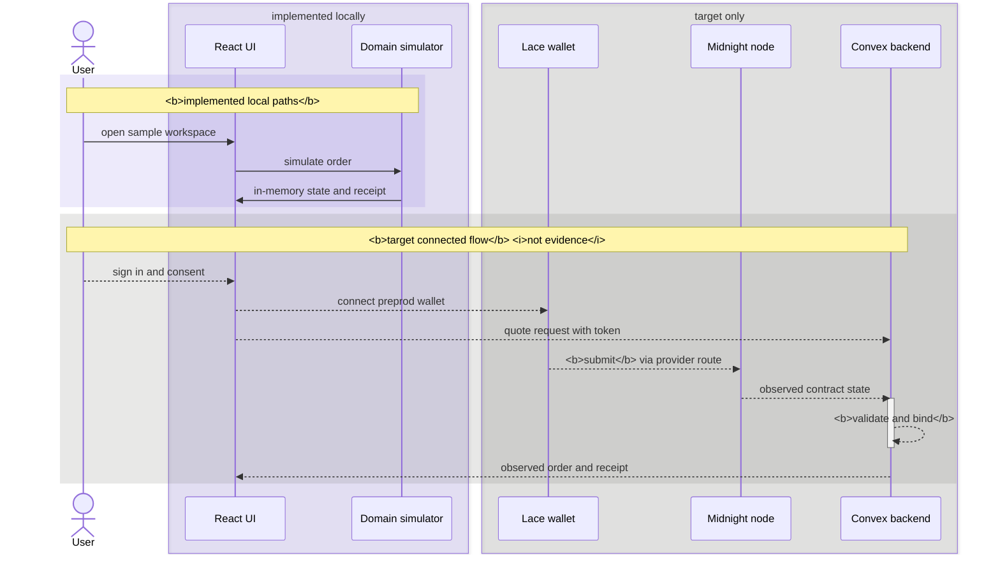

# milo

private agreements. clear approvals.

a privacy-first commissioning workspace for one fixed-price three-image deal. midnight enforces the
order rules. stripe handles payment off chain.

## demo


[walkthrough](https://youtu.be/bF968ODpTos) · [live workspace](https://milo-xkq.vercel.app)

## status

R0. provider acceptance 0/6, operation acceptance 0/14.

| layer | where | status |
| --- | --- | --- |
| browser workspace | local, in-memory | resets on refresh |
| contract | local chain | 14 proof circuits, tested |
| native and backend | local node, prover, backend | staged deploy, test doubles |
| providers | preprod | not admitted |

no preprod transaction has run. staged bootstrap runs locally, because the full deployment exceeds the
execution budget.

## architecture

solid edges are implemented locally, dashed edges are the target flow.



the lanes never meet, so no complete order is verifiable end to end.
[contract readme](packages/contract/README.md) covers each circuit.

## run it

needs linux x86_64, node, npm, python 3, curl, tar/xz, sha-256.

```sh
sh scripts/setup.sh
npm run dev        # localhost:3000, /demo, /orders/sample-001
npm run contract:compile
npm run typecheck
npm run lint
npm run test:unit
npm run build
```

compile before typecheck or tests. generated keys stay in ignored
`packages/contract/generated/`. the build writes static output and three public settings to
`dist/api/public-config`. the [integration readme](packages/integration/README.md) covers the native lane. `bun run
test:integration` provisions the pinned node and reinstalls the integration dependency
set on every run. it admits no order.

## safety

keep `PRIVY_APP_SECRET` and `STRIPE_SECRET_KEY` server side. rotate any secret shared in chat, and replace
any wallet whose seed was disclosed. sample receipts are not proofs.

## license

mit, see [LICENSE](LICENSE). third-party material keeps its own license, see
[third-party notices](THIRD_PARTY_NOTICES.md). the spec corpus is unpublished.
