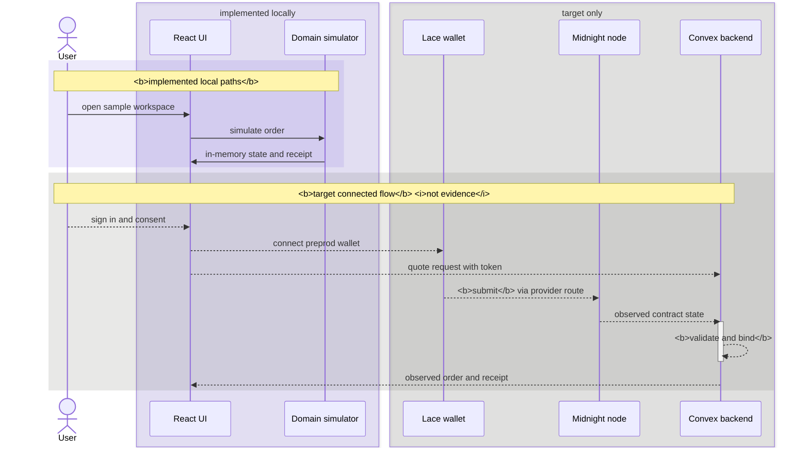

# milo

private agreements. clear approvals.

a privacy-first commissioning workspace. one fixed-price deal, one delivery of three images.
midnight enforces the order rules. stripe handles payment off chain.

## demo


[walkthrough](https://youtu.be/bF968ODpTos) · [live workspace](https://milo-xkq.vercel.app)

## status

R0, bounded implementation evidence. provider acceptance 0/6. operation acceptance 0/14. R1 to R5 open.

| layer | where | status |
| --- | --- | --- |
| browser workspace | local, in-memory model | implemented, resets on refresh |
| contract | local chain, `undeployed` | implemented, 14 proof circuits, tested |
| native lane | local node, indexer and prover | staged deploy only, no business circuit |
| convex admission | local backend | implemented, test doubles only |
| providers | preprod | not admitted, stripe is test prep |

no preprod transaction has run. the native observer stays on the isolated `undeployed` network. the
full deployment exceeds the measured execution budget, so staged bootstrap runs on a disposable local
address instead. it admits no order.

the [convex admission mutation](packages/backend/ADMISSION.md) holds one canonical binding across 16
competing calls, from synthetic inputs.

## architecture

solid arrows are implemented local paths. dashed arrows are the target connected flow, and are not
acceptance evidence.



the contract behind that flow is a phase machine of 14 proof circuits, documented in the
[contract readme](packages/contract/README.md).

the three lanes never meet, so no complete order is verifiable end to end yet. midnight does not verify
stripe payment. privy identity does not confer lace signing authority. a browser success label is not
proof.

## run it

needs linux x86_64, node, npm, python 3, curl, tar/xz and sha-256 tooling. no provider credentials are
needed for the demo, compilation or unit tests.

```sh
sh scripts/setup.sh
npm run dev        # localhost:3000, /demo, /orders/sample-001
npm run contract:compile
npm run typecheck
npm run lint
npm run test:unit
npm run build
```

compile before typecheck or tests, after checkout or contract edits. generated keys stay in ignored
`packages/contract/generated/`. the build writes static web output and three allowlisted public settings
to `dist/api/public-config`, served as json with `cache-control: no-store`.

the [integration readme](packages/integration/README.md) covers the native lane.

## safety

use public `PRIVY_APP_ID` and optional `CONVEX_URL` for browser settings only. keep `PRIVY_APP_SECRET`
and `STRIPE_SECRET_KEY` server side.

rotate any secret shared in chat, even test keys. replace any wallet whose seed was disclosed, and never
reuse it on mainnet. sample receipts are not payment confirmations or chain proofs.

## specs

the internal specification and audit corpus is not published.
[contract readme](packages/contract/README.md) covers circuit and dependency boundaries.

## license

project-original material is MIT, see [LICENSE](LICENSE). third-party material keeps its own license, see
[third-party notices](THIRD_PARTY_NOTICES.md).
