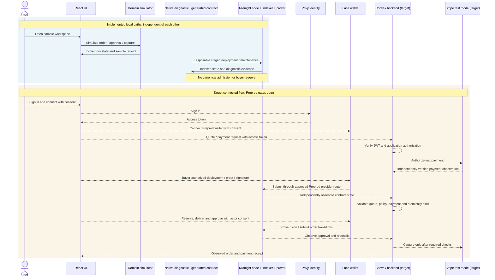

# milo

private agreements. clear approvals.

a privacy-first commissioning workspace. one fixed-price deal, one delivery of three images.
midnight enforces the order rules. stripe handles payment off chain.
this is not a live marketplace, an escrow service, or an admitted end-to-end midnight app.

## demo


[walkthrough](https://youtu.be/bF968ODpTos) · [player page](https://symulacr.github.io/milo/) · [live workspace](https://milo-xkq.vercel.app)

## status

R0, bounded implementation evidence. provider acceptance 0/6. operation acceptance 0/14. R1 to R5 stay open.

| layer | boundary |
| --- | --- |
| browser demo | fictional participants, original sample pngs, reset on refresh. role changes are not authorization |
| compact contract | real contract, real local runtime tests, 14 proof circuits |
| native midnight | isolated node, indexer and prover. no canonical admission, no buyer reservation |
| providers | `/connections` diagnostics for privy and lace. stripe is read-only test prep, not settlement |
| networks | preprod is the testing target. mainnet is gated and off |

no preprod transaction has run. the native observer stays on the isolated `undeployed` network, not a
verified preprod stack. the full single-transaction deployment exceeds the measured execution budget, so
staged bootstrap runs on a disposable local address instead. it does not prove a business circuit or
admit an order.

the [convex admission mutation](packages/backend/ADMISSION.md) has real local concurrency and restart
evidence. one canonical binding across 16 competing calls. its inputs are synthetic.

## how it works

solid arrows are implemented local paths. dashed arrows are the target connected flow, not acceptance
evidence. connection diagnostics do not join the simulated order state to that target.



midnight does not verify stripe payment or judge creative quality. privy identity does not confer lace
signing authority. the backend must independently validate observations and authorize actions. a browser
success label is not proof.

## run it

needs linux x86_64, node, npm, python 3, curl, tar/xz and sha-256 tooling.
no provider credentials are needed for the demo, compilation or unit tests.

```sh
sh scripts/setup.sh
npm run dev        # localhost:3000, /demo, /orders/sample-001
npm run contract:compile
npm run typecheck
npm run lint
npm run test:unit
npm run build
```

compile before typecheck or tests, after checkout or contract edits. generated keys and receipts stay in
ignored `packages/contract/generated/`. the build writes static web output, not a convex deployment.
it writes three allowlisted public settings to `dist/api/public-config`, which must be served as json
with `cache-control: no-store`. no server secret is included.

the [integration readme](packages/integration/README.md) covers the isolated native lane.

## safety

use public `PRIVY_APP_ID` and optional `CONVEX_URL` for browser settings only. keep `PRIVY_APP_SECRET`
and `STRIPE_SECRET_KEY` server side. never bundle them, and never put wallet recovery material in
environment examples. use `.env.example` for configuration names. `/connections` keeps missing convex
configuration explicit, and privy login alone does not establish a backend session.

rotate any secret shared in chat, even test keys. replace any wallet whose seed was disclosed. never
reuse that wallet on mainnet. do not enter real credentials, payment details or customer data in the
synthetic demo.

sample receipts are not payment confirmations or chain proofs. sample hash checks establish local byte
equality, not ownership, creative quality or chain commitments.

## specs

the internal specification and audit corpus is not published in this repository.
[contract readme](packages/contract/README.md) covers circuit and dependency boundaries.

## license

project-original material is MIT, see [LICENSE](LICENSE). third-party material keeps its own license,
see [third-party notices](THIRD_PARTY_NOTICES.md).
