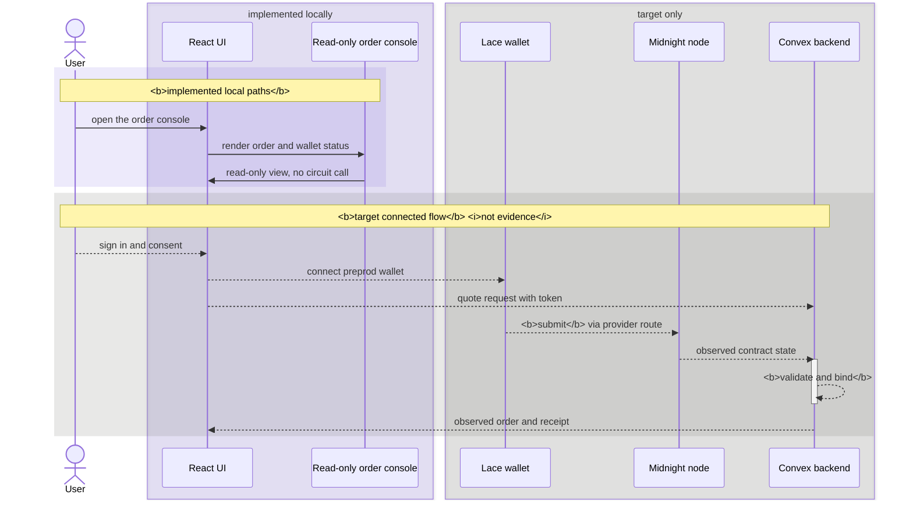

# Milo

private agreements. clear approvals.

a privacy-first commissioning workspace for one fixed-price three-image deal. midnight enforces the
order rules. stripe handles payment off chain.

## Demo


[walkthrough](https://youtu.be/bF968ODpTos) · [live workspace](https://milo-xkq.vercel.app)

## Status

R0. SUPERSEDED (A0-2 tree loss): product sources under convex/, scripts/, packages/{backend,contract,domain,integration} and packages/midnight-client are gone from this tree (see audit/discovery/BASELINE-P3.md); fresh suite counts are UNKNOWN. Historical claims below are receipts only. the contract is deployed on preprod. the browser workspace is a real read-only console rather
than a simulator, but no order is connected end to end: there is no hosted Convex deployment, no
Privy app id, and no browser circuit-call path, so the wallet, backend and chain lanes never meet.
*(W3-C3: the earlier blanket “no Convex” claim is superseded — local Convex observation ingest
now has runtime proof (A1); hosted Convex remains unprovisioned.)*

| layer | where | status |
| --- | --- | --- |
| browser workspace | browser, read-only console | renders wallet status and Convex payment observation; no circuit call |
| contract | preprod | deployed, 14 proof circuits exercised (execution 14/14 ≠ acceptance 0/14) |
| observer ingest | local Convex | SUPERSEDED (A0-2): `convex/observationIngest.ts` gone from tree; historical A1 RUNTIME receipt only |
| midnight client / wallet | SDK | **TESTED SDK only** (historical) — SUPERSEDED (A0-2 tree loss) — Lace connector + prepare gates; `WALLET_SIGNED_RESERVE_RUNTIME` unknown |
| native and backend | local node, prover, backend | staged deploy, test doubles; F-21 settlement fix TESTED |
| stripe | — | **no keys** (`STRIPE_SECRET_KEY`, `STRIPE_WEBHOOK_SECRET` missing); F-30 files **partial** |
| providers | preprod | exercised by the run, acceptance rows partial |

acceptance dual-state (see IMPLEMENTATION-DECISIONS D2): execution is 14/14 on
preprod (2026-09-20) while acceptance stays 0/6 provider · 0/14 operation until
the canonical criteria are met. **R1 is not complete** (`r1Complete` stays false).
new modules since the reconciliation pass, none
of which close an acceptance row.

SUPERSEDED (A0-2 tree loss): `packages/midnight-client` (browser Lace
transport + reserve/accept prepare gates; wallet-signed reserve still unknown),
`convex/observationIngest.ts` (durable deployment-observation writer — **local
Convex RUNTIME (A1)**; not a hosted-provider row),
`packages/backend/src/release-flags.mjs` (evidence-gated R1 flag single source of
truth), and `packages/backend/src/delivery-commitment.mjs` (digest-bound
delivery commitment). Those modules are GONE from this tree (BASELINE-P3); historical receipts only.

the contract address is
[`0xb95c8243f269c995c76577006f233b7c37f353067df8737b9b17537739e74586`](https://preprod.midnightexplorer.com/contracts/0xb95c8243f269c995c76577006f233b7c37f353067df8737b9b17537739e74586)
on midnight explorer, and the same contract on
[subscan](https://midnight-preprod.subscan.io/contract/0xb95c8243f269c995c76577006f233b7c37f353067df8737b9b17537739e74586),
which indexes accounts and canonicalises it to the bech32 contract
`mn_addr_preprod1h9wgysljd8yet3m9wuqx7gem0smlx5cx0hu8x7umzafhww08gkrqy5rlx4`. deploy is staged
because a single-transaction 14-key deploy exceeds the per-extrinsic execution budget: seven verifier
keys in one transaction and the remaining seven installed by maintenance update, read back from the
operation set as 14 of 14. both transactions are on chain and linkable: the deploy is
[`0xd10923d2...ab472`](https://preprod.midnightexplorer.com/transactions/0xd10923d24e70eb9c2e928f4cd18fd689822c85568d59b7ad3aa3af86222ab472)
in block **2636672**, which is where this contract's `ContractDeploy` sits, and the second seven keys
arrived in
[`0x8a6aed77...a8939`](https://preprod.midnightexplorer.com/transactions/0x8a6aed776b9ef01bc141da7414f008d56b64de47289e4bfce5bab7b2d52a8939)
in block **2636676**, the only `ContractUpdate` on this contract before the maintenance drills. the
run's own receipt recorded the ids `0x63f45a99...` and `0x06a85a07...` with no block heights; a direct
indexer query for both returns an empty result, so they are not on chain in any form, and the block is
the identity to cite rather than a second identifier. one earlier claim is corrected here: blocks
2636398 and 2636469 belong to the superseded contract `0x731948c6...`, which the resume-path defect
produced, not to this one. all 14 order
circuits finalized, each with a txId and a block height between 2638272 and 2639589, and the
must-reject suite was rejected at the contract layer with the expected asserts. maintenance drills
removed and restored a verifier key and then froze authority to an empty committee, leaving
`committee [], threshold 1, counter 4` and permanently non-upgradable authority; the three
maintenance calls resolve on chain as
[removeVerifierKey](https://preprod.midnightexplorer.com/transactions/0x3373b100e7f4fe70e4fbc49bdebbf8e8409c99cf968b0cb664c2c386eff269d9),
[insertVerifierKey](https://preprod.midnightexplorer.com/transactions/0xc36eaabfbb6e30549cca24175ea47169ad7c72f13b39f5286d26a34cde11bca4)
and
[replaceAuthority](https://preprod.midnightexplorer.com/transactions/0x5ce74cb9406e2d9398b0d3c5c949b2d86d5a3068e7b621ca5f0d1b6ee479cd58),
each showing this contract in its contract-action row. funding is on chain too: the DUST registration
transaction
[`0xebb3dd39...ba4fd`](https://preprod.midnightexplorer.com/transactions/0xebb3dd39cb87d1ed9bf5deda71650a6a344cf1738523d5606a8c03cc914ba4fd)
in block [2634013](https://preprod.midnightexplorer.com/blocks/2634013) spent the generating NIGHT
UTXO, and the wallet's spendable balance was measured at `60349100000000000` specks after the
operator funded five more UTXOs. provider acceptance is partial; no connected-provider order is
claimed.

what this does not prove: the off-chain half is prototyped, not deployed. no Convex deployment
exists, Privy is not configured, and the browser has no circuit-call path, so the wallet, backend and
chain lanes never meet and no order is verifiable end to end.

### Contracts and wallets, by address

| name | address | purpose | state |
| --- | --- | --- | --- |
| Milo commission contract (`order.compact`) | [`0xb95c8243...e74586`](https://preprod.midnightexplorer.com/contracts/0xb95c8243f269c995c76577006f233b7c37f353067df8737b9b17537739e74586) | the deployed contract this repo is about: it holds an order's phase, its hashed commitments and its terms, and decides who may move it. the brief, the files and the price stay off chain | **live** - 14 of 14 circuits driven, maintenance authority frozen to an empty committee |
| superseded first deploy | `0x731948c6...ce9aa` | the first attempt, produced by a resume-path defect. its failed deploy attempt is the only transaction in block 2636398 and its update the only one in 2636469 | abandoned, no order ran on it |
| stray redeploy | `0x554f9ff0b0...3f75a` | a second contract deployed from this source in the same block as the live one | abandoned |
| stray redeploy | `0x394bc7f2...f1ed1` | an earlier redeploy of the same source, the case the resume guard now prevents | abandoned |

### Funding a Preprod operator

| what | value |
| --- | --- |
| tNIGHT faucet | <https://midnight-tmnight-preprod.nethermind.dev/> - 1000 tNIGHT per request, captcha gated, and it refuses shielded and DUST addresses, so hand it the unshielded address below |
| wallet to fund (unshielded) | `mn_addr_preprod1y7kqu30rc3dq647v37r77eew7efml5pzvcgpntp28rv85fzzz7usc2n4h7` |
| DUST | accrues over time from the registered NIGHT and pays for every transaction. registration spends the generating UTXO, so generation stops until fresh funds are registered; a new UTXO then accrues retroactively |
| where the seed lives | `.env.preprod`, ignored by git and mode 0600. never commit it, never echo it |

## Architecture

solid edges are implemented locally, dashed edges are the target flow.


```mermaid
sequenceDiagram
    accTitle: Milo local and target paths
    accDescr: Solid arrows are implemented locally. Dashed arrows are the target flow.

    actor User
    box rgba(84, 52, 215, 0.12) implemented locally
        participant UI as React UI
        participant Console as Read-only order console
    end
    box rgba(92, 90, 87, 0.14) target only
        participant Wallet as Lace wallet
        participant Chain as Midnight node
        participant API as Convex backend
    end

    rect rgba(84, 52, 215, 0.10)
        Note over User,Console: <b>implemented local paths</b>
        User->>UI: open the order console
        UI->>Console: render order and wallet status
        Console->>UI: read-only view, no circuit call
    end
    rect rgba(92, 90, 87, 0.14)
        Note over User,API: <b>target connected flow</b> <i>not evidence</i>
        User-->>UI: sign in and consent
        UI-->>Wallet: connect preprod wallet
        UI-->>API: quote request with token
        Wallet-->>Chain: <b>submit</b> via provider route
        Chain-->>API: observed contract state
        activate API
        API-->>API: <b>validate and bind</b>
        deactivate API
        API-->>UI: observed order and receipt
    end
```

the lanes never meet, so no complete order is verifiable end to end.
[contract readme](packages/contract/README.md) covers each circuit.

## Run it

needs linux x86_64, node, npm, python 3, curl, tar/xz, sha-256.

```sh
sh scripts/setup.sh
npm run dev        # localhost:3000, /demo, /orders
npm run contract:compile
npm run typecheck
npm run lint
npm run test:unit
npm run build
```

compile before typecheck or tests. generated keys stay in ignored
`packages/contract/generated/`. the build writes static output and three public settings to
`dist/api/public-config`. the [integration readme](packages/integration/README.md) covers the native lane. `bun run
test:integration` provisions the pinned node and reinstalls the integration dependency
set on every run. it admits no order.

## Safety

keep `PRIVY_APP_SECRET` and `STRIPE_SECRET_KEY` server side. rotate any secret shared in chat, and replace
any wallet whose seed was disclosed. sample receipts are not proofs.

## License

mit, see [LICENSE](LICENSE). third-party material keeps its own license, see
[third-party notices](THIRD_PARTY_NOTICES.md). the spec corpus is unpublished.


## Quick start (verified)

```bash verify
test -f package.json
test -f packages/contract/src/order.compact
test -f .env.example
```

## How to test

```bash verify
bun install --frozen-lockfile
bun run typecheck
```
