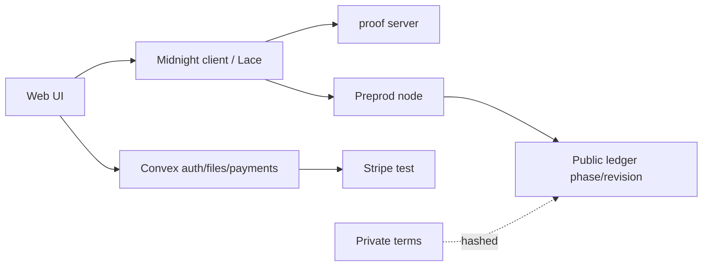

# Midnight integration (dual ledger)

## Dual-ledger model

| Plane | What lives there | Code |
|---|---|---|
| Public ledger | phase, revision, commitments, entrypoints, maintenance authority | `order.compact` circuits; `packages/contract/generated` |
| Private / off-chain | terms (price, rights, scope), file bytes, Stripe payment objects | `packages/domain`, `convex/files.ts`, Stripe test |

Private terms are hashed into `termsCommitment` and never posted as plaintext.
Witnesses and capability secrets stay in wallet private state
(`packages/midnight-client`, integration harness).

## Private-state management

- Buyer/merchant/operator capability secrets: `local-happy.mjs` / provider factory
- Private state IDs per actor: `happy-buyer`, `happy-merchant`
- Recovery kit retains operation identities (`packages/domain/src/recovery-kit.ts`)

## Diagram

Real-fee Preprod lifecycle is pending DUST (B-DUST-01).
