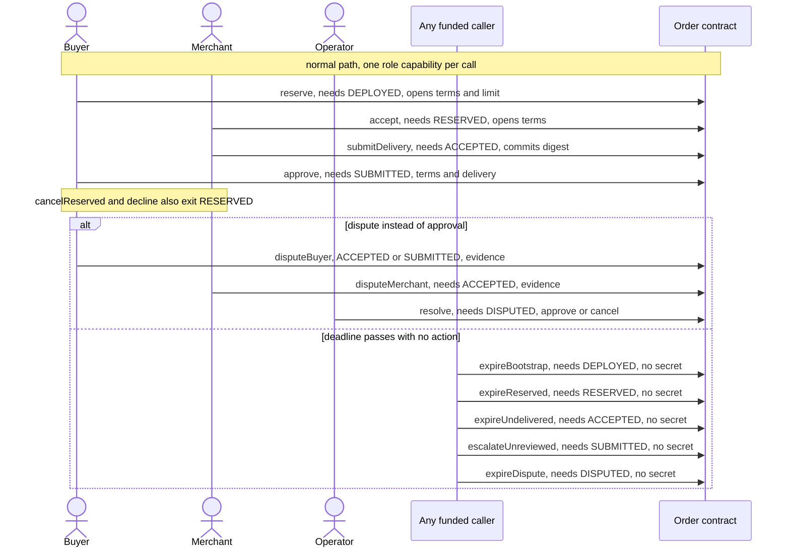

# Milo order contract

The contract behind Milo, a privacy-first commissioning workspace. `src/order.compact` is the only
contract source, and generated output is disposable. Full technical reference in [SPEC.md](SPEC.md).

## Circuit inventory

25 circuits declared, 16 exported, 2 of them pure helpers (`hashCapability`, `hashTerms`). The other
**14 are the proof-bearing state-transition circuits**, asserted against compiler metadata by
`scripts/compile-contract.ts`. Nine circuits are internal.

## Lifecycle

Every arrow is one proof-bearing circuit call. The label gives the required phase guard and what the
caller supplies. The five timeout and escalation calls invoke no witness.



Bootstrap is `DEPLOYED` revision zero, only a real buyer `reserve` enters `RESERVED`, and `APPROVED`
and `CANCELLED` are terminal. No `DRAFT` or `SETTLED` state, payment oracle, partial capture or
automatic quality decision is introduced. Predicates are `t < acceptance`, `t < delivery`, `t < review`
and `t < resolution`, and permissionless expiry uses `kernel.blockTimeGreaterThan(deadline - 1)`.
Timeouts never execute themselves, so a funded caller must prove and submit, and escalation enters
`DISPUTED` rather than approval. Nothing here claims to capture, void, refund or settle fiat.

## Guarantees

All commitments use Compact `persistentHash` and its typed field alignment. `hashTerms` and
`hashCapability` are exported **pure** helpers whose openings must never be sent as transaction
arguments. Roles are independently witnessed, so no action requests another actor's secret.

Service version 1, quantity 1, output count 3. Unit price is a positive integer bounded by `2^64-1`,
and quantity is constrained before multiplication so the total fits `Uint<64>`. `Terms.currency` is a
private witness checked against the build-time `USD` constant, so changing currency needs new reviewed
artifacts and admission, never an app configuration change. A circuit cannot prove entropy quality,
prevent frontend secret theft or make a remote prover blind, and fixed bytes in tests are fixtures
rather than a key-generation recipe. The compiler canary injects an undisclosed role-secret ledger
write into a temporary copy and requires a disclosure diagnostic from 0.31.1.

Commitment binding alone does not prevent a byte-identical deployment clone, so canonical
quote-to-address admission remains mandatory.

## Disclosure boundary

| Item | Boundary |
| --- | --- |
| Constructor `Configuration` | Fully public: network, nonce, commitments, four deadlines. No currency field, terms opening or secret. |
| `protocolVersion`, `configuration` | Public ledger, constructor-assigned only. No replacement circuit. |
| `phase`, `revision` | Public ledger. Each transition checks the supplied revision and increments once. |
| `deliveryCommitment`, `evidenceCommitment` | Public ledger. Delivery is set once and nonzero. |
| Submit, approve, dispute and resolve arguments | Disclosed commitment bytes, not file bytes, URLs or openings. |
| `agreedTerms`, `buyerApprovalLimit` | Private witnesses. A reserve-only, self-declared limit, not available funds or employer authority. |
| Timeout circuits | Public state and time predicates only. No witness is invoked. |

Payment, quality, file availability, manifest byte validation, off-chain access control and recovery
are not contract assertions. The caller must validate the three-file manifest before using its
commitment, and operator approval with no submitted delivery is forbidden.

## Toolchain

Compact compiler **0.31.1**, language **0.23**, `@midnight-ntwrk/compact-runtime` **0.16.0**,
`@midnight-ntwrk/onchain-runtime-v3` **3.0.0**.

```sh
.tools/compact/compiler/compactc packages/contract/src/order.compact packages/contract/generated
bun test packages/contract/tests
```

The sibling `zkir` must be executable, and `--skip-zk` does not produce complete artifact evidence.
Tests run real compiler-generated circuits on synthetic inputs. They are **not** proof generation,
proof verification, wallet balancing, deployment, node acceptance, indexer observation or browser
evidence, and they close no provider or operation row. Verifier-key substitution, canonical address
admission and circuit replacement still need the supported local-network integration, and no
maintenance-disable API exists. Block immutable-order admission until those checks pass.

[SPEC.md](SPEC.md) carries the full encoding preimages, the complete disclosure inventory, the evidence
boundary and the upstream syntax receipts.
