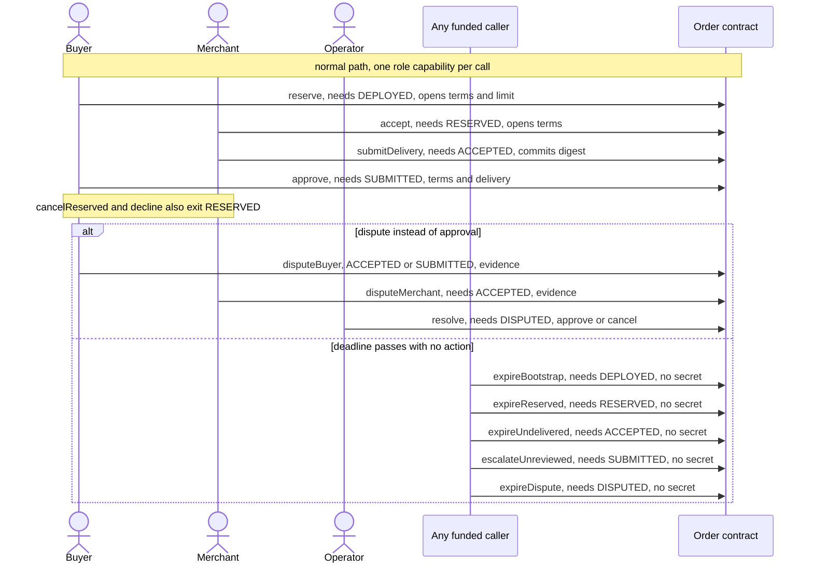

# Milo order contract, local compiler and runtime slice

Canonical authority: blueprint sections 2.4, 3.7 and 4, and roadmap M-02 and M-03, neither published here. This is an original Milo order state machine, not the synthetic UI/domain simulator. `src/order.compact` is the only contract source. Generated output is disposable.

## Circuit inventory

25 circuits declared, 16 exported, 2 of them pure helpers (`hashCapability`, `hashTerms`). The other **14 are the proof-bearing state-transition circuits**, asserted against compiler metadata by `scripts/compile-contract.ts`. The diagram below names every one.

## Toolchain and evidence boundary

Compact compiler **0.31.1**, language **0.23**, `@midnight-ntwrk/compact-runtime` **0.16.0**, `@midnight-ntwrk/onchain-runtime-v3` **3.0.0**.

- Compile from the repository root: `.tools/compact/compiler/compactc packages/contract/src/order.compact packages/contract/generated`. The sibling `zkir` must be executable, and `--skip-zk` does not produce complete artifact evidence.
- Tests: `bun test packages/contract/tests` with the repository-pinned Bun. MID-T01 to T14 mark runtime-owned portions only.
- Tests run real compiler-generated circuits on synthetic inputs. They are **not** proof generation, proof verification, balancing, deployment, node acceptance, indexer observation or browser evidence, and close no provider or operation row.
- Raw-ledger injection tests bypass constructor validation and need the proved `reserve` circuit to reject malformed configuration, which is generated-runtime evidence, not network deployment evidence. Verifier-key substitution, canonical address admission and circuit replacement still need the supported local-network integration, and no maintenance-disable API exists. Block immutable-order admission until those checks pass.

## Versioned encoding

All commitments use Compact `persistentHash` and its typed field alignment. `hashTerms` and `hashCapability` are exported **pure** helpers whose openings must never be sent as transaction arguments.

Terms preimage, in order: padded `milo:terms:v1`, `Uint<16>` one, a `Bytes<32>` network id and order nonce, then the `Terms` struct (`serviceVersion`, `packQuantity`, `outputCount`, `unitPrice`, `total`, `currency`, `scopeDigest`, `rightsDigest`, `paymentPolicy`, `salt`).

Capability preimage: padded `milo:capability:v1`, `Uint<16>(1)`, network, nonce, typed `Role` (`BUYER=0`, `MERCHANT=1`, `OPERATOR=2`) and a `Bytes<32>` secret. Roles are independently witnessed, so no action requests another actor's secret. That binding does not prevent a byte-identical deployment clone, so canonical quote-to-address admission remains mandatory.

Service version 1, quantity 1, output count 3. Unit price is a positive integer bounded by `2^64-1`, and quantity is constrained before multiplication so the total fits `Uint<64>`. Reservation checks the buyer-only limit. `Terms.currency` is a private witness checked against the build-time `USD` constant, so changing currency needs new reviewed artifacts, never an app configuration change. Currency stays inferable from the public deployment policy, and removing the ledger field is not a confidentiality guarantee.

Application creation must use fresh randomness for nonce, salt and independent capabilities. A circuit cannot prove entropy quality, prevent frontend secret theft or make a remote prover blind, and fixed bytes in tests are fixtures, not a recipe. The compiler canary injects an undisclosed role-secret ledger write into a temporary copy and requires a disclosure diagnostic from 0.31.1, and terminal-state checks use a fresh revision so rejection cannot be blamed on replay.

## Disclosure boundary

| Item | Boundary |
| --- | --- |
| Constructor `Configuration` | Fully public: network, nonce, commitments, four deadlines. No currency field, terms opening or secret. |
| `protocolVersion`, `configuration` | Public ledger, constructor-assigned only. No replacement circuit. |
| `phase`, `revision` | Public ledger. Each transition checks the supplied revision, rejects exhaustion, increments once. |
| `deliveryCommitment`, `evidenceCommitment` | Public ledger. Delivery is set once and nonzero. Dispute evidence can be replaced by the operator's resolution evidence, and history is not erased. |
| Dispute, resolve and submit arguments | Disclosed commitment bytes, not file bytes, URLs, evidence text or openings. |
| `agreedTerms`, `buyerApprovalLimit` | Private witnesses. A reserve-only, self-declared limit, not available funds or employer authority. |
| Timeout circuits | Public state and time predicates only. No witness is invoked. |

Payment, quality, file availability, manifest byte validation, off-chain access control and recovery are not contract assertions. The caller must validate the three-file manifest before using its commitment, and operator approval with no submitted delivery is forbidden.

## State/time policy

Every arrow below is one proof-bearing circuit call. The label gives the required phase guard and what the caller supplies. The five timeout and escalation calls invoke no witness.

Bootstrap is `DEPLOYED` revision zero, only a real buyer `reserve` enters `RESERVED`, and `APPROVED` and `CANCELLED` are terminal. No `DRAFT` or `SETTLED` state, payment oracle, partial capture or automatic quality decision is introduced.

Reservation rechecks version, phase, revision zero, empty delivery and evidence, distinct role commitments and ordered deadlines, sharing the constructor's validator. A malformed deployment cannot obtain a valid reservation from matching openings alone, and non-USD terms are rejected even with raw-injected configuration.

Predicates are `t < acceptance`, `t < delivery`, `t < review` and `t < resolution`. Permissionless expiry uses `kernel.blockTimeGreaterThan(deadline - 1)`, and tests supply a runtime **block context**, not a contract time witness. Timeouts never execute themselves, so a funded caller must prove and submit, and escalation enters `DISPUTED` rather than approval. Nothing here claims to capture, void, refund or settle fiat.
